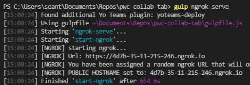
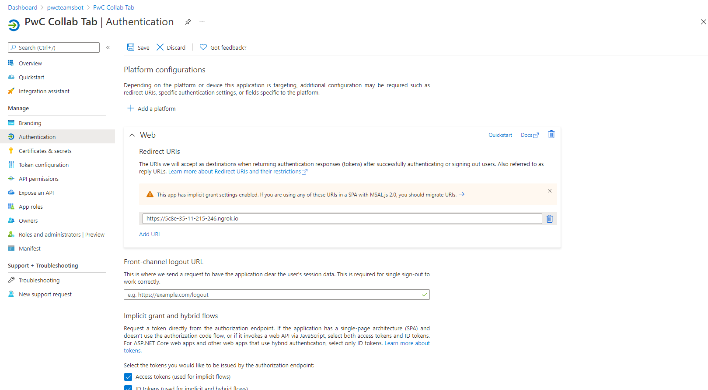
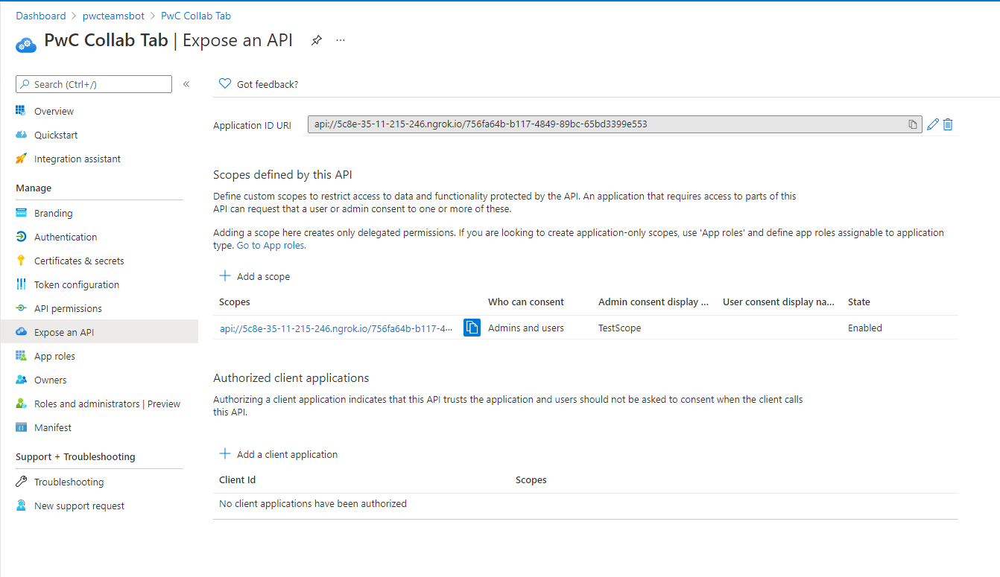

# PwC Collab Tab

# PwC Collab Tab

## Before running the app locally

If you are not part of the *pwcteamsbot* tenant, ask Sean or Zach to add you. New Users are added [here](https://admin.microsoft.com/Adminportal/Home#/users). 

Make sure you have access to the [pwc-collab-tab repository](https://git.cse.msu.edu/nguye610/pwc-collab-tab). Pull this project to your local development environment.

### Required dependencies:

* Visual Studio Code
* Node.js/npm
* [ngrok](https://ngrok.com/)
  * Sign up and download ngrok
  * Extract the ngrok.exe and run it anywhere
  * Connect your account with `ngrok authtoken xx_example_authtoken_xx`

### Required packages:
Install gulp-cli and Yeoman packages with these commands:

```bash
npm install yo gulp-cli --global
npm install generator-teams --global
```

Install Microsoft Graph API clients with these commands:

```bash
npm install @microsoft/microsoft-graph-client
npm install @types/microsoft-graph --save-dev
```

## Running the app locally

Run `gulp ngrok-serve` in the main directory of the project.



Each time `ngrok-serve` runs, a URL will be generated with a random hostname. Copy the URL (For example, https://4d7b-35-11-215-246.ngrok.io)

Go to the [Azure Active Directory admin center](https://aad.portal.azure.com/) for the *pwcteamsbot* tenant, and go into App Registrations. View All applications, and select PwC Collab Tab. Select Authentication for this app, and add or edit a Redirect URI.



**Whenever you are done testing locally, go ahead and delete your URI. These only persist while your session of ngrok is running. Consistent hostnames is a paid feature, and we do not have money, so deal with this workaround**



Also edit the application ID URI in the Expose an API menu. The URI should follow the format of api://REPLACE.ngrok.io/756fa64b-b117-4849-89bc-65bd3399e553.

**Additionally, edit every instance of the random hostname in your `.env` file.**

Ensure your ngrok has started hosting your app. The bottom of the terminal ouptut should say something along the lines of `msteams Server running on 3007`.

Open up a Microsoft Teams client (use the in-browser version [here](https://teams.microsoft.com/)) and inside a team, add a tab app using the '+' sign on the channel tabs.

Select Manage Apps, then Upload a custom app, then upload the zip file found in `pwc-collab-tab/package`.

Once the app is uploaded, it can be added as a tab app.

# Extra Documentation

## Getting started with Microsoft Teams Apps development

Head on over to [Microsoft Teams official documentation](https://developer.microsoft.com/en-us/microsoft-teams) to learn how to build Microsoft Teams Tabs or the [Microsoft Teams Yeoman generator docs](https://github.com/PnP/generator-teams/docs) for details on how this solution is set up.

## Project setup

All required source code are located in the `./src` folder:

* `client` client side code
* `server` server side code
* `public` static files for the web site
* `manifest` for the Microsoft Teams app manifest

For further details see the [Yo Teams documentation](https://github.com/PnP/generator-teams/docs)

## Building the app

The application is built using the `build` Gulp task.

``` bash
npm i -g gulp-cli
gulp build
```

## Building the manifest

To create the Microsoft Teams Apps manifest, run the `manifest` Gulp task. This will generate and validate the package and finally create the package (a zip file) in the `package` folder. The manifest will be validated against the schema and dynamically populated with values from the `.env` file.

``` bash
gulp manifest
```

## Deploying the manifest

Using the `yoteams-deploy` plugin, automatically added to the project, deployment of the manifest to the Teams App store can be done manually using `gulp tenant:deploy` or by passing the `--publish` flag to any of the `serve` tasks.


## Configuration

Configuration is stored in the `.env` file.

## Debug and test locally

To debug and test the solution locally you use the `serve` Gulp task. This will first build the app and then start a local web server on port 3007, where you can test your Tabs, Bots or other extensions. Also this command will rebuild the App if you change any file in the `/src` directory.

``` bash
gulp serve
```

To debug the code you can append the argument `debug` to the `serve` command as follows. This allows you to step through your code using your preferred code editor.

``` bash
gulp serve --debug
```

## Useful links
 * [Debugging with Visual Studio Code](https://github.com/pnp/generator-teams/blob/master/docs/docs/vscode.md)
 * [Developing with ngrok](https://github.com/pnp/generator-teams/blob/master/docs/docs/ngrok.md)
 * [Developing with Github Codespaces](https://github.com/pnp/generator-teams/blob/master/docs/docs/codespaces.md)


## Additional build options

You can use the following flags for the `serve`, `ngrok-serve` and build commands:

* `--no-linting` or `-l` - skips the linting of Typescript during build to improve build times
* `--debug` - builds in debug mode
* `--env <filename>.env` - use an alternate set of environment files
* `--publish` - automatically publish the application to the Teams App store

## Deployment

The solution can be deployed to Azure using any deployment method.

* For Azure Devops see [How to deploy a Yo Teams generated project to Azure through Azure DevOps](https://www.wictorwilen.se/blog/deploying-yo-teams-and-node-apps/)
* For Docker containers, see the included `Dockerfile`

## Logging

To enable logging for the solution you need to add `msteams` to the `DEBUG` environment variable. See the [debug package](https://www.npmjs.com/package/debug) for more information. By default this setting is turned on in the `.env` file.

Example for Windows command line:

``` bash
SET DEBUG=msteams
```

If you are using Microsoft Azure to host your Microsoft Teams app, then you can add `DEBUG` as an Application Setting with the value of `msteams`.
